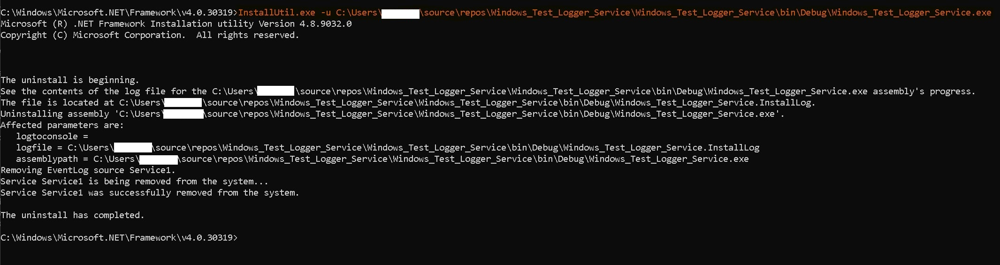
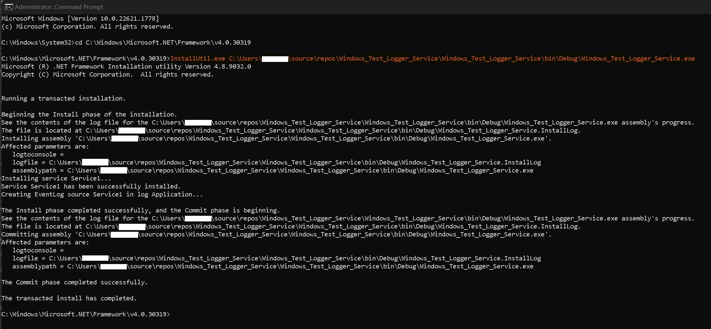

# Windows Test Logger Service

[](img/1.jpg)

This version of the native windows C# service runs on the `.Net Framework 4.8`.

This application runs in the background completing automation tasks.

Open `services.msc` to see services

## Initial Setup

In `ProjectInstaller.cs` Select the `InitializeComponent` method and press the F12 key to go definition.

```C#
this.serviceInstaller1.StartType = ServiceStartMode.Automatic;
//this.serviceInstaller1.DelayedAutoStart = true;
this.serviceInstaller1.Description = "A Windows_Test_Logger_Service Service demo Application";
this.serviceInstaller1.DisplayName = "Windows_Test_Logger_Service Service";
this.serviceInstaller1.ServiceName = "Windows_Test_Logger_Service.exe_Service";
```

[](img/2.jpg)

## To Install

Open Admin cmd

```CMD
cd C:\Windows\Microsoft.NET\Framework\v4.0.30319
```

```CMD
InstallUtil.exe path\to\exe\app.exe
```

## To Uninstall

Open Admin cmd

```CMD
cd C:\Windows\Microsoft.NET\Framework\v4.0.30319
```

```CMD
InstallUtil.exe -u path\to\exe\app.exe
```
## To Control

To start a service

```CMD
net start service_name
```

To stop a service

```CMD
net stop service_name
```

To pause a service

```CMD
net pause service_name
```

To resume a service

```CMD
net continue service_name
```

Start example in C#

```C#
System.Diagnostics.Process.Start("net", "start Windows_Test_Logger_Service.exe_Service").WaitForExit();
```
